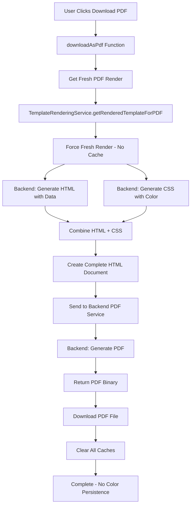

# PDF Generation Flow

## 🔄 Complete PDF Generation Process

## 🏗️ Architecture Overview



## 📋 Step-by-Step Process

### 1. PDF Download Initiation

```typescript
// ResumePreview.tsx
const downloadAsPdf = async () => {
  if (!resumeData) return;

  try {
    setIsLoading(true);

    // Get candidate name for filename
    const candidateName = resumeData?.PersonalInfo?.Name ||
      resumeData?.personalInfo?.name ||
      resumeData?.name ||
      resumeData?.Name ||
      'resume';

    console.log('Downloading PDF using centralized rendering service');
```

### 2. Fresh PDF Render Generation

```typescript
// Get fresh render for PDF to ensure accuracy (this clears color caches)
const pdfRender = await templateRenderingService.getRenderedTemplateForPDF(
  template,
  resumeData,
  selectedColor
);

console.log('Got fresh PDF render, sending to backend');
```

### 3. PDF-Specific Rendering Service

```typescript
// templateRenderingService.ts
public async getRenderedTemplateForPDF(
  templateId: string, 
  resumeData: any, 
  color: string
): Promise<RenderedTemplate> {
  
  return await this.renderResume({
    templateId,
    resumeData,
    color,
    forceRefresh: true // Always fresh for PDF to ensure accuracy
  });
}
```

### 4. Force Fresh Render

```typescript
private async renderResume(options: TemplateRenderOptions): Promise<RenderedTemplate> {
  const { templateId, resumeData, color, forceRefresh = false } = options;
  
  // For PDF generation, we ALWAYS force refresh
  if (forceRefresh) {
    console.log('Forcing fresh render for PDF generation');
    return await this.performRender(templateId, resumeData, color);
  }
  
  // ... cache logic for preview only
}
```

### 5. Backend HTML Generation (Same as Preview)

```csharp
// Backend: ResumeBuilderController.cs
[HttpPost("build")]
public async Task<IActionResult> BuildResume([FromBody] BuildResumeRequest request)
{
    try
    {
        // Parse resume data with color
        var resumeData = JsonSerializer.Deserialize<Dictionary<string, object>>(request.ResumeData);
        
        // Ensure color is included in data
        if (!string.IsNullOrEmpty(request.Color))
        {
            resumeData["Color"] = request.Color;
            resumeData["color"] = request.Color;
        }
        
        // Get template HTML
        var templateHtml = _templateService.GetTemplateHtml(request.TemplateId);
        
        // Populate template with data
        var template = Handlebars.Compile(templateHtml);
        var populatedHtml = template(resumeData);
        
        return Ok(new { success = true, data = new { html = populatedHtml } });
    }
    catch (Exception ex)
    {
        return BadRequest(new { error = ex.Message });
    }
}
```

### 6. Backend CSS Generation (Same as Preview)

```csharp
// Backend: TemplateController.cs
[HttpGet("{templateId}/css")]
public IActionResult GetTemplateCss(string templateId, [FromQuery] string? color = null)
{
    try
    {
        var css = _templateService.GetTemplateCss(templateId, color);
        
        // Add PDF-specific optimizations
        var pdfOptimizedCss = css + @"
        
        /* PDF-specific optimizations */
        @media print {
          * {
            -webkit-print-color-adjust: exact !important;
            color-adjust: exact !important;
            print-color-adjust: exact !important;
          }
          
          body {
            background: white !important;
            padding: 0 !important;
            margin: 0 !important;
          }
          
          .resume-container {
            box-shadow: none !important;
            border-radius: 0 !important;
            max-width: none !important;
            width: 794px !important;
            margin: 0 !important;
          }
        }";
        
        return Content(pdfOptimizedCss, "text/css");
    }
    catch (Exception ex)
    {
        return BadRequest(new { error = ex.Message });
    }
}
```

### 7. Complete HTML Document for PDF

```typescript
private createCompleteHtmlDocument(html: string, css: string, resumeData: any): string {
  const candidateName = resumeData?.PersonalInfo?.Name || 'Resume';

  return `<!DOCTYPE html>
<html lang="en">
<head>
  <meta charset="UTF-8">
  <meta name="viewport" content="width=device-width, initial-scale=1.0">
  <title>${candidateName} - Resume</title>
  <style>
    /* PDF-optimized reset */
    * {
      margin: 0;
      padding: 0;
      box-sizing: border-box;
      -webkit-print-color-adjust: exact !important;
      color-adjust: exact !important;
      print-color-adjust: exact !important;
    }
    
    body {
      font-family: 'Segoe UI', Tahoma, Geneva, Verdana, sans-serif;
      line-height: 1.6;
      color: #333;
      background: white;
      padding: 0;
      margin: 0;
    }
    
    /* Template-specific styles with color */
    ${css}
    
    /* PDF-specific print styles */
    @media print {
      body {
        background: white !important;
        padding: 0 !important;
      }
      
      .no-print {
        display: none !important;
      }
      
      /* Ensure page breaks work correctly */
      .page-break {
        page-break-before: always;
      }
      
      .avoid-break {
        page-break-inside: avoid;
      }
    }
  </style>
</head>
<body>
  ${html}
</body>
</html>`;
}
```

### 8. Send to Backend PDF Service

```typescript
// Send the complete HTML to backend for PDF generation
const response = await api.resumeBuilder.downloadResume({
  resumeText: pdfRender.fullHtml,
  format: "pdf"
});

if (!response || !response.ok) {
  throw new Error(`Server responded with status: ${response?.status || 'unknown'}`);
}
```

### 9. Backend PDF Generation

```csharp
// Backend: ResumeBuilderController.cs
[HttpPost("download")]
public async Task<IActionResult> DownloadResume([FromBody] DownloadResumeRequest request)
{
    try
    {
        if (request.Format.ToLower() == "pdf")
        {
            // Use a PDF generation library (e.g., PuppeteerSharp, iTextSharp, etc.)
            var pdfBytes = await GeneratePdfFromHtml(request.ResumeText);
            
            return File(pdfBytes, "application/pdf", "resume.pdf");
        }
        
        return BadRequest(new { error = "Unsupported format" });
    }
    catch (Exception ex)
    {
        return StatusCode(500, new { error = ex.Message });
    }
}

private async Task<byte[]> GeneratePdfFromHtml(string html)
{
    // Example using PuppeteerSharp
    using var browser = await Puppeteer.LaunchAsync(new LaunchOptions
    {
        Headless = true,
        Args = new[] { "--no-sandbox", "--disable-setuid-sandbox" }
    });
    
    using var page = await browser.NewPageAsync();
    
    // Set content and wait for fonts/styles to load
    await page.SetContentAsync(html);
    await page.WaitForTimeoutAsync(1000); // Allow time for rendering
    
    // Generate PDF with specific options
    var pdfBytes = await page.PdfAsync(new PdfOptions
    {
        Format = PaperFormat.A4,
        PrintBackground = true,
        MarginOptions = new MarginOptions
        {
            Top = "0.5in",
            Right = "0.5in", 
            Bottom = "0.5in",
            Left = "0.5in"
        }
    });
    
    return pdfBytes;
}
```

### 10. Frontend PDF Download

```typescript
// Process the PDF response
const arrayBuffer = await response.arrayBuffer();
const blob = new Blob([arrayBuffer], { type: 'application/pdf' });

if (blob.size === 0) {
  throw new Error('Generated PDF is empty');
}

// Create download link
const url = URL.createObjectURL(blob);
const link = document.createElement('a');
link.href = url;
link.download = `${candidateName.toLowerCase().replace(/\s+/g, '_')}_resume.pdf`;
document.body.appendChild(link);
link.click();
document.body.removeChild(link);
URL.revokeObjectURL(url);
```

### 11. Post-Download Cache Clearing

```typescript
// Clear color caches after PDF download to prevent color persistence
console.log('Clearing color caches after PDF download');
clearAllColorCaches();

toast({
  title: "PDF Downloaded Successfully",
  description: "Your resume has been saved as a PDF file with exact preview formatting.",
});
```

### 12. Complete Cache Clearing

```typescript
// ResumeColorContext.tsx
const clearAllColorCaches = useCallback(() => {
  console.log('Clearing all color caches');
  templateRenderingService.clearAllCaches();
}, []);

// templateRenderingService.ts
public clearAllCaches(): void {
  console.log('Clearing all caches for fresh rendering');
  
  // Clear render cache
  this.renderCache.clear();
  
  // Clear active renders
  this.activeRenders.clear();
  
  // Clear browser-level caches
  this.clearBrowserCaches();
  
  // Clear DOM styles
  this.clearDOMStyles();
}
```

## 🎯 Key Differences: Preview vs PDF

### Preview Generation
- **Uses Cache**: For performance
- **DOM Styles**: Applied to page for display
- **Partial HTML**: Just the resume content
- **Interactive**: Can be refreshed, updated

### PDF Generation  
- **Always Fresh**: No cache, ensures accuracy
- **Complete HTML**: Full document with embedded styles
- **Print Optimized**: PDF-specific CSS rules
- **Final Output**: Immutable file download

## 🔒 Ensuring Preview = PDF

### 1. Same Rendering Service
```typescript
// Both use the same service, different methods
const preview = await templateRenderingService.getRenderedTemplateForPreview(...);
const pdf = await templateRenderingService.getRenderedTemplateForPDF(...);
```

### 2. Same Backend APIs
```typescript
// Both call the same backend endpoints
POST /api/resume-builder/build  // HTML generation
GET /api/template/{id}/css      // CSS generation
```

### 3. Same Color Application
```csharp
// Same CSS generation method for both
case "navy-column-modern":
    return GenerateNavyColumnModernCss(templateColor);
```

### 4. Same HTML Structure
```typescript
// Same complete HTML document structure
const fullHtml = this.createCompleteHtmlDocument(html, css, resumeData);
```

## 🚀 Performance Optimizations

### PDF-Specific Optimizations

```css
/* PDF generation optimizations */
@media print {
  * {
    -webkit-print-color-adjust: exact !important;
    color-adjust: exact !important;
    print-color-adjust: exact !important;
  }
  
  /* Optimize for A4 paper */
  .resume-container {
    width: 794px !important;  /* A4 width in pixels at 96 DPI */
    max-width: none !important;
  }
  
  /* Prevent page breaks in critical sections */
  .employment-history-role,
  .education-entry {
    page-break-inside: avoid;
    break-inside: avoid;
  }
}
```

### Backend PDF Generation Optimizations

```csharp
// Puppeteer optimization for better PDF quality
var pdfOptions = new PdfOptions
{
    Format = PaperFormat.A4,
    PrintBackground = true,
    PreferCSSPageSize = true,
    DisplayHeaderFooter = false,
    MarginOptions = new MarginOptions
    {
        Top = "0.5in",
        Right = "0.5in",
        Bottom = "0.5in", 
        Left = "0.5in"
    },
    // Wait for fonts and images to load
    WaitUntil = new[] { WaitUntilNavigation.Networkidle0 }
};
```

## 🐛 Error Handling

### PDF Generation Errors

```typescript
try {
  const pdfRender = await templateRenderingService.getRenderedTemplateForPDF(
    template, resumeData, selectedColor
  );
  
  const response = await api.resumeBuilder.downloadResume({
    resumeText: pdfRender.fullHtml,
    format: "pdf"
  });
  
  // ... download logic
  
} catch (error) {
  console.error('PDF export failed:', error);
  toast({
    title: "PDF Download Failed",
    description: "Unable to generate PDF. Please try again or contact support.",
    variant: "destructive"
  });
} finally {
  setIsLoading(false);
}
```

### Backend Error Handling

```csharp
try
{
    var pdfBytes = await GeneratePdfFromHtml(request.ResumeText);
    return File(pdfBytes, "application/pdf", "resume.pdf");
}
catch (Exception ex)
{
    _logger.LogError(ex, "PDF generation failed");
    return StatusCode(500, new { 
        error = "PDF generation failed", 
        details = ex.Message 
    });
}
```

## 📊 PDF Generation Performance

### Typical Generation Times

| Step | Time (ms) | Notes |
|------|-----------|-------|
| Fresh Render | 200-500 | No cache used |
| HTML Generation | 100-300 | Backend processing |
| CSS Generation | 50-150 | Template-specific |
| PDF Conversion | 1000-3000 | Puppeteer rendering |
| File Download | 100-500 | Network transfer |
| **Total Time** | **1500-4500** | **1.5-4.5 seconds** |

### File Sizes

| Template | Typical Size | Notes |
|----------|-------------|-------|
| navy-column-modern | 150-300 KB | With sidebar colors |
| modern-executive | 100-250 KB | Header gradient |
| Simple templates | 80-150 KB | Minimal styling |

## 🔮 Future Enhancements

### Planned Features
- **High-Quality PDF**: Vector graphics, better fonts
- **Custom Page Sizes**: Letter, Legal, A3 options
- **Watermarks**: Draft/Final markings
- **Password Protection**: Secure PDF downloads
- **Batch Generation**: Multiple resumes at once

### Technical Improvements
- **Faster PDF Engine**: WebAssembly-based generation
- **Progressive Download**: Stream PDF as it generates
- **Quality Options**: Draft/Standard/High quality modes
- **Compression**: Smaller file sizes
- **Accessibility**: PDF/A compliance

## 🎯 Quality Assurance

### Testing Checklist
- [ ] Preview matches PDF exactly
- [ ] Colors render correctly in PDF
- [ ] Fonts display properly
- [ ] Layout maintains structure
- [ ] Page breaks work correctly
- [ ] File downloads successfully
- [ ] Caches cleared after download
- [ ] Error handling works
- [ ] Performance acceptable
- [ ] Multiple templates tested

### Validation Process
1. **Visual Comparison**: Preview vs PDF side-by-side
2. **Color Accuracy**: Verify hex colors match
3. **Typography**: Check font rendering
4. **Layout**: Ensure no broken elements
5. **Performance**: Monitor generation times
6. **Error Cases**: Test failure scenarios