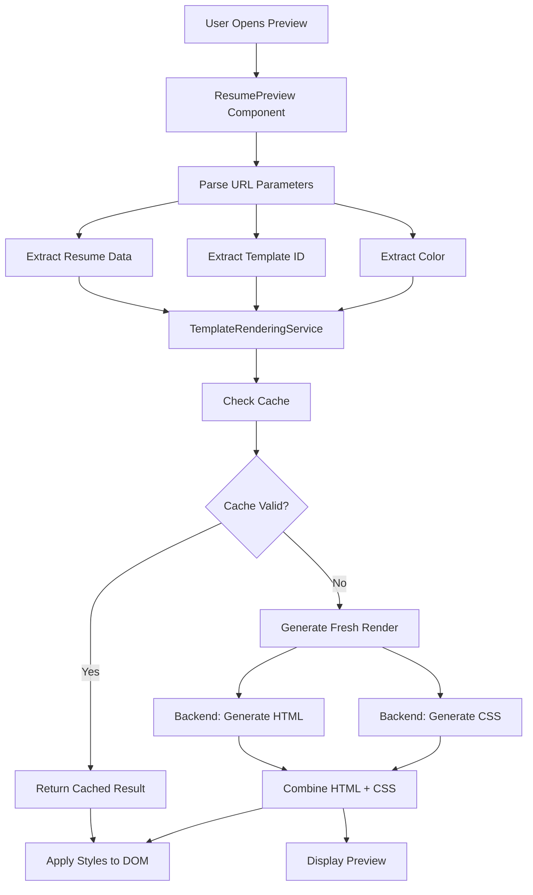

# Preview Generation Flow

## 🔄 Complete Preview Generation Process

## 🏗️ Architecture Overview



## 📋 Step-by-Step Process

### 1. Component Initialization

```typescript
// ResumePreview.tsx
const ResumePreview = () => {
  const [searchParams] = useSearchParams();
  
  // Extract parameters from URL
  const template = searchParams.get('template') || 'navy-column-modern';
  const encodedData = searchParams.get('data');
  const selectedColor = searchParams.get('color') ? 
    decodeURIComponent(searchParams.get('color')!) : '#315389';
```

### 2. Data Parsing

```typescript
// Decode and parse resume data from URL
const decodedData = decodeURIComponent(encodedData);
const parsedData = JSON.parse(decodedData);

console.log('Resume data parsed:', {
  name: parsedData.Name || parsedData.name,
  template,
  color: selectedColor
});
```

### 3. Centralized Rendering

```typescript
// Use centralized service for consistent rendering
const rendered = await templateRenderingService.getRenderedTemplateForPreview(
  template,
  parsedData,
  selectedColor
);
```

### 4. Template Rendering Service Logic

```typescript
// templateRenderingService.ts
public async getRenderedTemplateForPreview(
  templateId: string, 
  resumeData: any, 
  color: string
): Promise<RenderedTemplate> {
  
  return await this.renderResume({
    templateId,
    resumeData,
    color,
    forceRefresh: false // Use cache for preview performance
  });
}
```

### 5. Cache Check

```typescript
private async renderResume(options: TemplateRenderOptions): Promise<RenderedTemplate> {
  const cacheKey = this.getCacheKey(templateId, color);
  
  // Check cache first (unless force refresh)
  if (!forceRefresh) {
    const cached = this.renderCache.get(cacheKey);
    if (cached && this.isCacheValid(cached.timestamp)) {
      console.log('Using cached render for:', cacheKey);
      return cached;
    }
  }
  
  // Generate fresh render if no cache
  return await this.performRender(templateId, resumeData, color);
}
```

### 6. Fresh Render Generation

```typescript
private async performRender(templateId: string, resumeData: any, color: string): Promise<RenderedTemplate> {
  // Prepare data with color
  const resumeDataWithColor = {
    ...resumeData,
    Color: color,
    color: color
  };

  // 1. Generate HTML with data from backend
  const response = await fetch(`${this.API_BASE_URL}/resume-builder/build`, {
    method: 'POST',
    headers: { 'Content-Type': 'application/json' },
    body: JSON.stringify({
      resumeData: JSON.stringify(resumeDataWithColor),
      templateId,
      color
    }),
  });

  const result = await response.json();
  const html = result.data.html;
  
  // 2. Get CSS with color
  const css = await this.fetchTemplateCss(templateId, color);
  
  // 3. Create complete HTML document
  const fullHtml = this.createCompleteHtmlDocument(html, css, resumeData);
  
  return { html, css, fullHtml, templateId, color, timestamp: Date.now() };
}
```

### 7. Backend HTML Generation

```csharp
// Backend: ResumeBuilderController.cs
[HttpPost("build")]
public async Task<IActionResult> BuildResume([FromBody] BuildResumeRequest request)
{
    // Parse resume data
    var resumeData = JsonSerializer.Deserialize<Dictionary<string, object>>(request.ResumeData);
    
    // Get template HTML
    var templateHtml = _templateService.GetTemplateHtml(request.TemplateId);
    
    // Populate template with data using Handlebars
    var template = Handlebars.Compile(templateHtml);
    var populatedHtml = template(resumeData);
    
    return Ok(new { success = true, data = new { html = populatedHtml } });
}
```

### 8. Backend CSS Generation

```csharp
// Backend: TemplateController.cs
[HttpGet("{templateId}/css")]
public IActionResult GetTemplateCss(string templateId, [FromQuery] string? color = null)
{
    var css = _templateService.GetTemplateCss(templateId, color);
    return Content(css, "text/css");
}
```

### 9. CSS Fetching

```typescript
private async fetchTemplateCss(templateId: string, color: string): Promise<string> {
  const url = new URL(`${this.API_BASE_URL}/template/${templateId}/css`);
  url.searchParams.append('color', color);
  url.searchParams.append('timestamp', Date.now().toString()); // Prevent caching
  
  const response = await fetch(url.toString(), {
    cache: 'no-cache',
    headers: {
      'Cache-Control': 'no-cache',
      'Pragma': 'no-cache'
    }
  });
  
  return await response.text();
}
```

### 10. Complete HTML Document Creation

```typescript
private createCompleteHtmlDocument(html: string, css: string, resumeData: any): string {
  const candidateName = resumeData?.PersonalInfo?.Name || 'Resume';

  return `<!DOCTYPE html>
<html lang="en">
<head>
  <meta charset="UTF-8">
  <meta name="viewport" content="width=device-width, initial-scale=1.0">
  <title>${candidateName} - Resume</title>
  <style>
    /* Reset and base styles */
    * { margin: 0; padding: 0; box-sizing: border-box; }
    body { font-family: 'Segoe UI', sans-serif; background: #f5f6fa; padding: 0.5in; }
    
    /* Template-specific styles */
    ${css}
    
    /* Print styles */
    @media print {
      body { background: white; padding: 0; }
      .no-print { display: none !important; }
    }
  </style>
</head>
<body>
  ${html}
</body>
</html>`;
}
```

### 11. DOM Style Application

```typescript
public applyStylesToDOM(css: string, templateId: string): void {
  // Remove existing template styles
  this.clearDOMStyles();
  
  // Create new style element
  const styleElement = document.createElement('style');
  styleElement.setAttribute('data-template-styles', 'true');
  styleElement.setAttribute('data-template-id', templateId);
  styleElement.textContent = css;
  
  // Insert at beginning of head for maximum priority
  if (document.head.firstChild) {
    document.head.insertBefore(styleElement, document.head.firstChild);
  } else {
    document.head.appendChild(styleElement);
  }
}
```

### 12. Preview Display

```typescript
// ResumePreview.tsx - Render the preview
{renderedTemplate ? (
  <div className="space-y-4">
    <div className="flex justify-end">
      <Button onClick={refreshPreview} disabled={isRefreshing}>
        <RefreshCw className={`h-4 w-4 ${isRefreshing ? 'animate-spin' : ''}`} />
        {isRefreshing ? 'Refreshing...' : 'Refresh Preview'}
      </Button>
    </div>
    
    <div
      id="resume-preview-container"
      className="resume-preview-container template-transition"
      dangerouslySetInnerHTML={{ __html: renderedTemplate.html }}
    />
  </div>
) : (
  <div className="template-error">
    <AlertCircle className="h-8 w-8 mx-auto mb-2" />
    <p>Failed to load resume preview</p>
  </div>
)}
```

## 🚀 Performance Optimizations

### Caching Strategy

```typescript
// Cache rendered templates for 2 minutes
private readonly CACHE_DURATION = 2 * 60 * 1000;

// Cache key includes template and color for uniqueness
private getCacheKey(templateId: string, color: string): string {
  return `${templateId}_${color}`;
}
```

### Preventing Duplicate Requests

```typescript
// Track active renders to prevent duplicate requests
private activeRenders = new Map<string, Promise<RenderedTemplate>>();

if (this.activeRenders.has(cacheKey)) {
  console.log('Waiting for active render:', cacheKey);
  return await this.activeRenders.get(cacheKey)!;
}
```

### Cache Invalidation

```typescript
// Clear cache when colors change
const setTemplateColor = useCallback((templateId: string, color: string) => {
  // Clear all caches to ensure fresh rendering
  templateRenderingService.clearAllCaches();
  
  // Update color state
  setTemplateColorsState(prev => ({ ...prev, [templateId]: color }));
}, []);
```

## 🔄 Refresh Functionality

### Manual Refresh

```typescript
const refreshPreview = async () => {
  if (!resumeData) return;
  
  setIsRefreshing(true);
  try {
    // Clear all caches to ensure fresh rendering
    clearAllColorCaches();
    
    // Get fresh render from centralized service
    const rendered = await templateRenderingService.getRenderedTemplateForPreview(
      template,
      resumeData,
      selectedColor
    );
    
    setRenderedTemplate(rendered);
    templateRenderingService.applyStylesToDOM(rendered.css, template);
    
  } catch (error) {
    toast({
      title: "Refresh Failed",
      description: "Failed to refresh preview. Please try again.",
      variant: "destructive"
    });
  } finally {
    setIsRefreshing(false);
  }
};
```

## 🐛 Error Handling

### Template Not Found

```typescript
// Backend returns error for unsupported templates
catch (ArgumentException ex) {
  return BadRequest(new { 
    error = $"Template '{templateId}' not supported for CSS generation" 
  });
}
```

### Frontend Error Handling

```typescript
try {
  const rendered = await templateRenderingService.getRenderedTemplateForPreview(
    template, parsedData, selectedColor
  );
  setRenderedTemplate(rendered);
} catch (error) {
  console.error('Failed to initialize preview:', error);
  toast({
    title: "Preview Error",
    description: "Failed to load resume preview. Please try generating the resume again.",
    variant: "destructive"
  });
}
```

## 📊 Preview Generation Performance

### Typical Flow Times

| Step | Time (ms) | Cacheable |
|------|-----------|-----------|
| URL Parsing | <1 | No |
| Data Parsing | 1-5 | No |
| Cache Check | <1 | N/A |
| HTML Generation | 100-300 | Yes |
| CSS Generation | 50-150 | Yes |
| DOM Application | 10-50 | No |
| **Total (Cached)** | **<100** | - |
| **Total (Fresh)** | **200-500** | - |

### Cache Hit Rates

- **Same Color**: ~90% cache hit
- **Color Change**: 0% cache hit (by design)
- **Template Switch**: 0% cache hit (by design)

## 🎯 Key Benefits

### For Users
- **Fast Loading**: Cached previews load instantly
- **Consistent Colors**: Preview matches selected color exactly
- **Real-time Updates**: Color changes reflect immediately
- **Reliable Rendering**: Same engine as PDF generation

### For System
- **Performance**: Intelligent caching reduces server load
- **Consistency**: Single rendering path for all previews
- **Scalability**: Cache strategy handles high traffic
- **Maintainability**: Centralized logic easy to update

## 🔮 Future Enhancements

### Planned Features
- **Progressive Loading**: Show partial preview while loading
- **Preview Modes**: Mobile, tablet, desktop views
- **Real-time Editing**: Live preview updates as user types
- **Collaboration**: Shared preview links
- **Version History**: Preview previous versions

### Technical Improvements
- **Service Worker**: Offline preview capability
- **WebAssembly**: Client-side template rendering
- **Streaming**: Progressive preview loading
- **Prefetching**: Preload likely template combinations