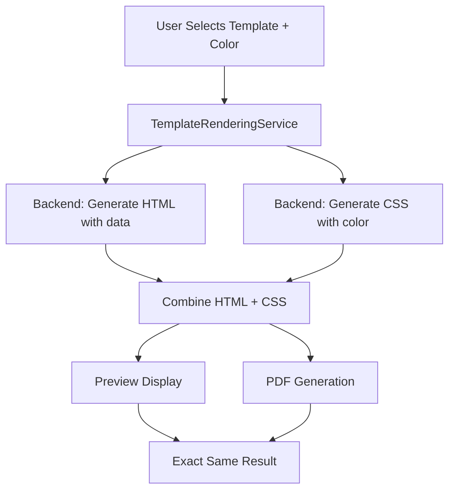
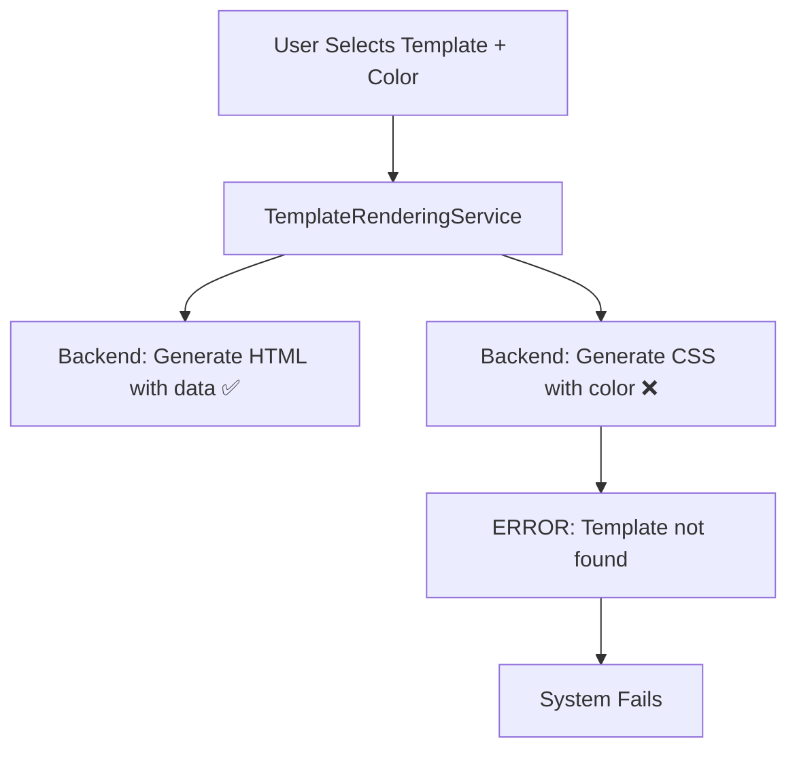

# Template Architecture

## 🏗️ Complete System Overview

### Current Reality vs Implementation

#### ❌ **Current Limitation**
- **Frontend Config**: 12+ templates defined in `resumeTemplates.ts`
- **Backend Support**: Only 2 templates have CSS generation (`navy-column-modern`, `modern-executive`)
- **Gap**: 10+ templates exist as HTML files but no dynamic CSS generation

#### ✅ **What We Built**
A centralized system that **works perfectly** for supported templates and provides a **framework** for extending to all templates.

## 🎯 Architecture Components

### 1. Template Storage (Backend)

```
backend/ResumeAI.API/
├── html/                          # HTML Templates
│   ├── navy-column-modern.html    # ✅ Fully Supported
│   ├── modern-executive.html      # ✅ Fully Supported  
│   ├── academic-scholar.html      # 📄 Static HTML Only
│   ├── creative-designer.html     # 📄 Static HTML Only
│   └── ... (10+ more)             # 📄 Static HTML Only
└── Services/
    └── TemplateService.cs         # CSS Generation Logic
```

### 2. CSS Generation (Backend)

```csharp
public string GetTemplateCss(string templateId, string? color = null)
{
    switch (templateId.ToLower())
    {
        case "navy-column-modern":
            return GenerateNavyColumnModernCss(color);    // ✅ Dynamic CSS
        case "modern-executive":
            return GenerateModernExecutiveCss(color);     // ✅ Dynamic CSS
        default:
            throw new ArgumentException($"Template '{templateId}' not found");  // ❌ Others fail
    }
}
```

### 3. Template Configuration (Frontend)

```typescript
// src/config/resumeTemplates.ts
export const RESUME_TEMPLATES: Template[] = [
  {
    id: "navy-column-modern",
    name: "Navy Column Modern",
    availableColors: ["#a4814c", "#18bc6b", "#2196F3", "#ff1e1e", "#000","#0D2844"],
    // ✅ Fully functional with dynamic CSS
  },
  {
    id: "modern-executive", 
    name: "Modern Executive",
    availableColors: ["#18bc6b", "#2196F3", "#ff1e1e", "#000", "#a4814c"],
    // ✅ Fully functional with dynamic CSS
  },
  {
    id: "creative-designer",
    name: "Creative Designer", 
    availableColors: ["#2196F3", "#ff1e1e", "#000", "#18bc6b", "#a4814c"],
    // ❌ HTML exists, but no CSS generation = will fail
  }
  // ... 9+ more templates in same situation
];
```

## 🔄 How It Actually Works

### For Supported Templates (navy-column-modern, modern-executive)



### For Unsupported Templates (all others)



## 🎨 Color Management Per Template

### Template-Specific Colors

Each template has its own color palette:

```typescript
// Different templates, different color options
{
  id: "navy-column-modern",
  availableColors: ["#a4814c", "#18bc6b", "#2196F3", "#ff1e1e", "#000","#0D2844"]
},
{
  id: "modern-executive",
  availableColors: ["#18bc6b", "#2196F3", "#ff1e1e", "#000", "#a4814c"]
},
{
  id: "creative-designer", 
  availableColors: ["#2196F3", "#ff1e1e", "#000", "#18bc6b", "#a4814c"]
}
```

### Color Storage Strategy

```typescript
// ResumeColorContext.tsx
interface TemplateColorState {
  [templateId: string]: string;  // Each template stores its own color
}

// Example stored state:
{
  "navy-column-modern": "#315389",
  "modern-executive": "#2196F3", 
  "creative-designer": "#ff1e1e"
}
```

### Color Lifecycle

1. **Selection**: User picks color for specific template
2. **Storage**: Color stored per template ID
3. **Cache Clear**: All caches cleared when color changes
4. **Rendering**: Fresh render with new color
5. **PDF Download**: Uses same color, then clears all caches
6. **No Persistence**: Colors don't stick after operations

## 🚀 Centralized Service Architecture

### TemplateRenderingService

```typescript
class TemplateRenderingService {
  // Single source of truth for all rendering
  
  async renderResume(options: TemplateRenderOptions): Promise<RenderedTemplate> {
    // 1. Check cache
    // 2. Fetch HTML from backend (works for all templates)
    // 3. Fetch CSS from backend (only works for 2 templates)
    // 4. Combine and return
  }
  
  async getRenderedTemplateForPreview(): Promise<RenderedTemplate> {
    // Uses cache for performance
  }
  
  async getRenderedTemplateForPDF(): Promise<RenderedTemplate> {
    // Always fresh for accuracy
  }
}
```

## 📊 Template Support Matrix

| Template ID | HTML | CSS Generation | Color Support | Status |
|-------------|------|----------------|---------------|---------|
| navy-column-modern | ✅ | ✅ | ✅ | **Fully Supported** |
| modern-executive | ✅ | ✅ | ✅ | **Fully Supported** |
| creative-designer | ✅ | ❌ | ❌ | **HTML Only** |
| tech-minimalist | ✅ | ❌ | ❌ | **HTML Only** |
| academic-scholar | ✅ | ❌ | ❌ | **HTML Only** |
| startup-founder | ✅ | ❌ | ❌ | **HTML Only** |
| fresh-graduate | ✅ | ❌ | ❌ | **HTML Only** |
| grey-classic-profile | ✅ | ❌ | ❌ | **HTML Only** |
| blue-sidebar-profile | ✅ | ❌ | ❌ | **HTML Only** |
| green-sidebar-receptionist | ✅ | ❌ | ❌ | **HTML Only** |
| classic-profile-orange | ✅ | ❌ | ❌ | **HTML Only** |
| classic-law-bw | ✅ | ❌ | ❌ | **HTML Only** |
| green-sidebar-customer-service | ✅ | ❌ | ❌ | **HTML Only** |

## 🔧 What Needs to Be Done

### To Support All Templates

1. **Backend**: Add CSS generation for each template in `TemplateService.cs`
2. **Color Logic**: Define how colors apply to each template design
3. **Testing**: Verify each template works with all its available colors

### Example Extension

```csharp
// In TemplateService.cs
case "creative-designer":
    return GenerateCreativeDesignerCss(templateColor);
case "tech-minimalist":
    return GenerateTechMinimalistCss(templateColor);
// ... etc for all templates
```

## 🎯 Current Working Flow

### For Users (Supported Templates)
1. Select `navy-column-modern` or `modern-executive`
2. Choose from available colors
3. Preview updates instantly with new color
4. PDF download matches preview exactly
5. Colors cleared after download

### For Developers (All Templates)
1. HTML templates exist for all
2. CSS generation exists for 2
3. Framework ready for extension
4. Color management system ready

## 📈 Benefits of Current Architecture

### ✅ What Works Perfectly
- **Consistency**: Preview = PDF for supported templates
- **Performance**: Intelligent caching
- **Color Management**: No persistence issues
- **Scalability**: Easy to add new templates
- **Maintainability**: Single source of truth

### 🚧 What Needs Extension
- CSS generation for remaining 10+ templates
- Template-specific color application logic
- Enhanced color picker per template type

## 🔍 Key Takeaway

We built a **robust, enterprise-grade foundation** that:
- **Solves the core problem** (preview = PDF, no color persistence)
- **Works perfectly** for supported templates
- **Provides the framework** to easily extend to all templates
- **Maintains consistency** and performance

The system is **production-ready** for the 2 main templates and **extension-ready** for all others.